# Mythos Manager

MythosManager is a Dungeons & Dragons character management app that simplifies the creation and 
tracking of characters and campaigns. The app features character creation, a campaign tracker, and 
the ability to add custom homebrew creations.

## Features

MythosManager will feature user accounts, and users will be able to create and save D&D characters. 
Characters will also be editable, and if a user desires they can share it to the public database of 
characters that other users have made. Public characters can be imported by any user if they wish to 
also use that character. Users will also be able to organize their campaign notes into a campaign 
tracker. MythosManager will also feature the ability to create homebrew ideas and upload those ideas 
publicly. The overall purpose for MythosManager is to streamline the playing process of a D&D 
campaign.

## Roadmap

- **User Registration**
    - **Anticipated Development Time: 3-5 days**
    - Simple sign up page and login/logout functionality
    - Can use Firebase here
    - Possibly add ability to delete account, to conform to AppStore requirements

- **Character Creator**
    - **Anticipated Development Time: 1-2 week(s)**
    - Designed as a multi page form for creating a character
        - First page for race, next for class, and so on for each element of a Character
        - Need to be able to go back and change things if needed
        - Finalization page to confirm all details

    - General App Navigation
        - Hamburger menu type navigation
        - Home Page and Characters Page

***The above is the minimum anticipated scope of work that should be done by first check in date.***

- **Character Editing**
    - **Anticipated Development Time: 3-5 days**
    - Allow characters to be edited over time when the user wishes
    - Utilize same multi page system for creating a character to edit

- **Campaign Tracker**
    - **Anticipated Development Time: 1 week**
    - Ability to organize notes by campaign
    - Store images (such as maps)

- **Public Database**
    - **Anticipated Development Time: 1 week**
    - Store characters with Firebase using FireStore
    - Adds ability to make characters public and shareable if user wishes to
    - Add public characters page
        - Allow others to import these characters into their own list of characters

- **Homebrew Creation Tools**
    - **Anticipated Development Time: 1-2 week(s)**
    - Add the ability to create custom spells, races, and subclasses
    - Add one homebrew page for creating all types of homebrew content
    - Page to display homebrew creations
    - Allow sharing with public database

- **Campaign Groups**
    - **Anticipated Development Time: REMAINING TIME**
    - Add ability to create a group campaign, users can invite each other to a campaign
    - Character for a campaign can be seen, and notes can be shared

## Tech Stack

**Main Framework:** Flutter, Dart

**State Management:** [Riverpod](https://riverpod.dev/)

**Dungeons and Dragons Data API:** [D&D 5e API](https://www.dnd5eapi.co/)

**Database:** Firebase/FireStore

## Authors

- Jonathon Meney
- Sherif Abdalla
- Liam Welsh

## Mockup
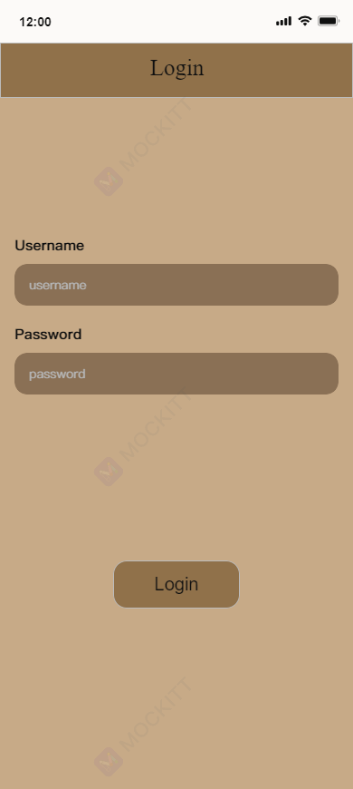

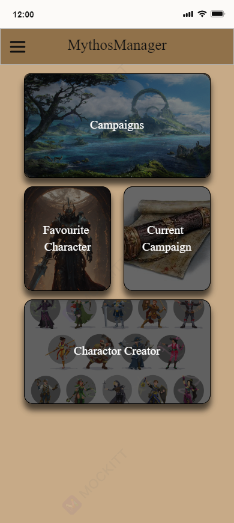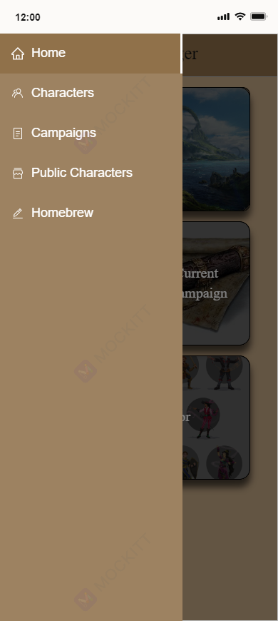

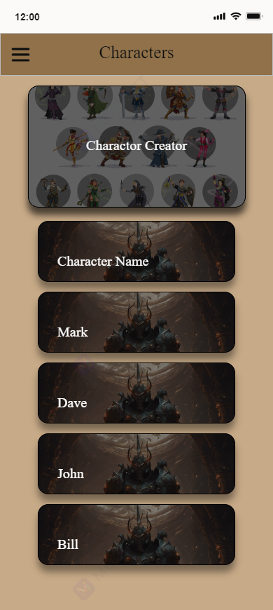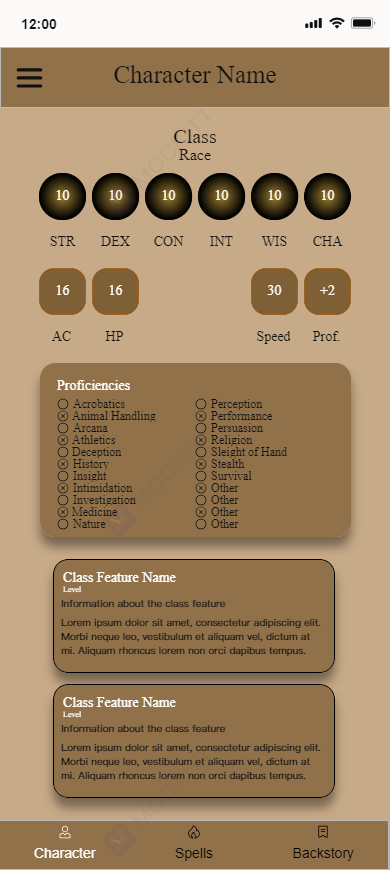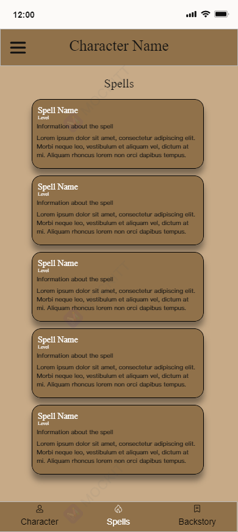

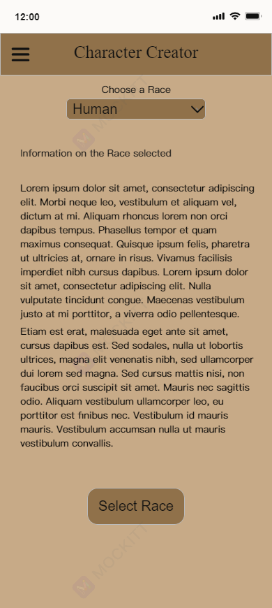
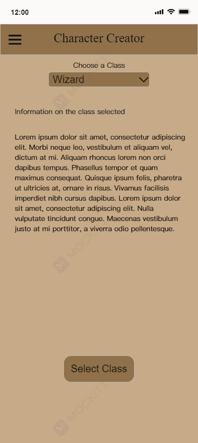

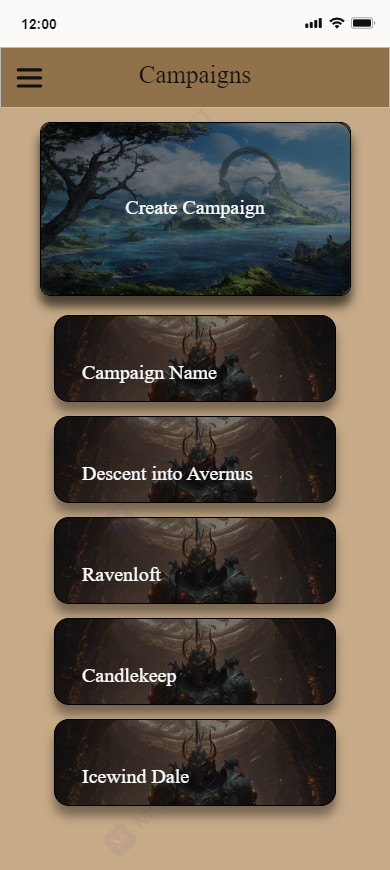
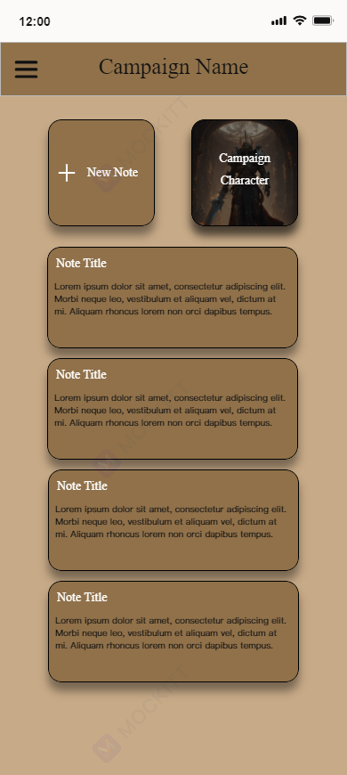
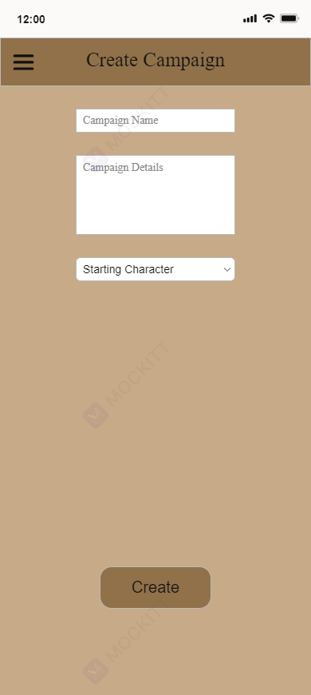

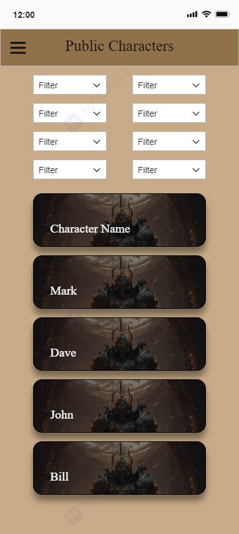
